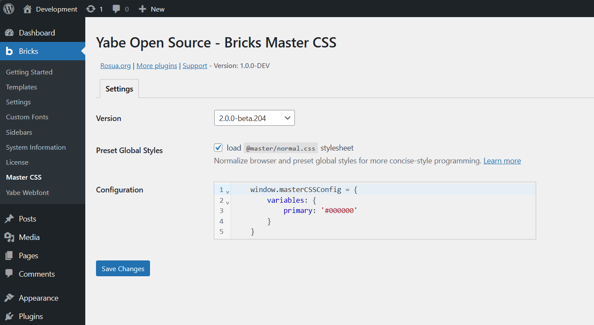

# Yabe Open Source - Bricks Master CSS

    <a aria-label="GitHub release (latest by date including pre-releases)" href="https://github.com/yabe-open-source/bricks-master-css/releases">
        <picture>
            
        </picture>
    </a>
    <a aria-label="GitHub Sponsors" href="https://github.com/sponsors/suabahasa">
        <picture>
            
        </picture>
    </a>
    <a aria-label="Support me on Ko-fi" href="https://ko-fi.com/Q5Q75XSF7">
        <picture>
            
        </picture>
    </a>
    <a aria-label="Join Our Facebook community" href="https://www.facebook.com/groups/1142662969627943">
        <picture>
            
        </picture>
    </a>

The [Master CSS](https://css.master.co) integration for the [Bricks Builder](https://bricksbuilder.io) plugin.

## Installation

1. Download the plugin zip file
2. Install the plugin by uploading the zip file
3. Activate the plugin

## TO DO

Add the classes name autocomplete integration with [Yabe Open Source - Bricks Plain Classes](https://github.com/yabe-open-source/bricks-master-css) plugin.

## License

[GPL-3.0](./LICENSE)

## Credits

- [Vue.js](https://vuejs.org)
- [CodeMirror](https://codemirror.net)
- [axios](https://axios-http.com)